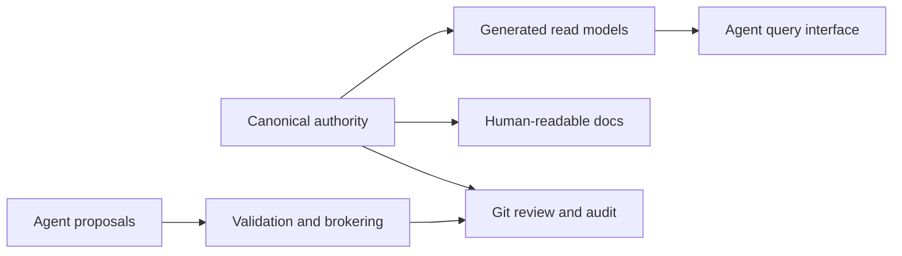
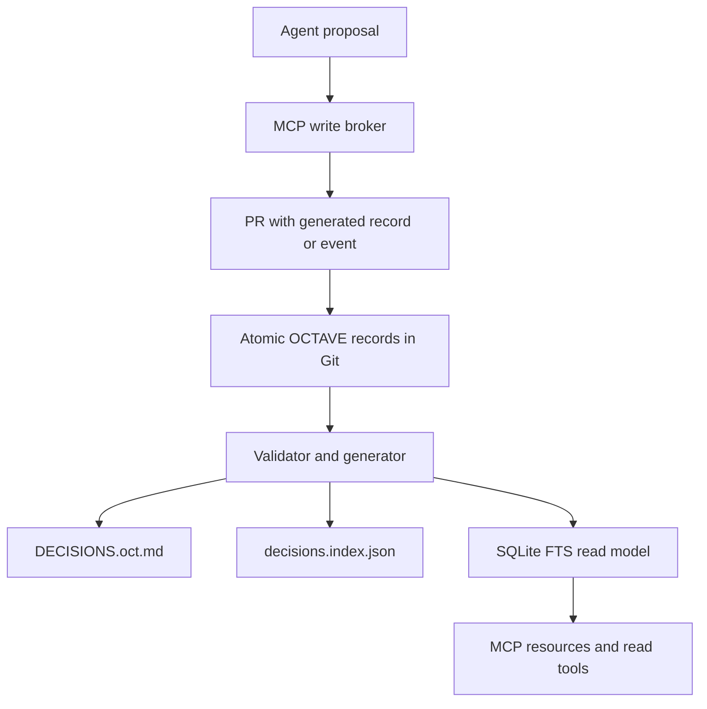
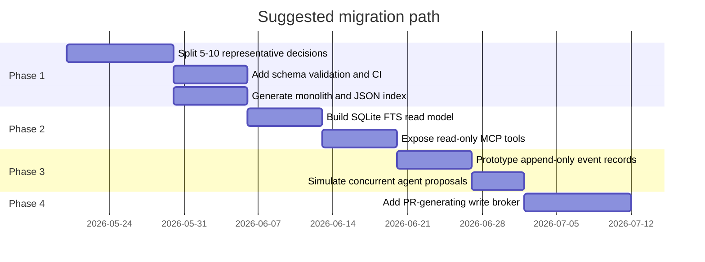

# Multi-Agent Decision Registry Architecture for AI-Native Engineering Governance

## Executive summary

Elevana’s problem is not primarily “which ADR template should we use?” It is how to keep one authoritative decision corpus readable by many agents, writable by a few controlled actors, auditable by humans, and safe under concurrent change. The practical options in today’s ecosystem fall into seven broad patterns: Git-native sharded decision files; append-only decision event logs; database-backed registries; MCP read and write brokers; bot-managed PR queues; CRDT-based collaborative stores; and structured merge or instruction-layer mitigations. The ADR ecosystem is mature for file-per-decision workflows, with MADR, adr-tools, adr-log, ADR Manager, dotnet-adr, Backstage ADR support, and adjacent docs-as-code tooling. MCP is now a real standard for exposing resources and tools to agents, but it standardises interfaces, not governance. SQLite/Postgres, Notion, Airtable, and Backstage can all serve as registry layers, but they vary sharply in reviewability, lock-in, and authority clarity. citeturn8view1turn8view2turn14view2turn14view1turn14view3turn25view0turn8view0turn18view0turn18view1turn16search17turn9view0turn23search0

There is no single industry-standard product that already solves “AI-native decision registry concurrency” end to end. What does exist is a mature set of components: ADR files for human-readable decisions; Git PRs, CODEOWNERS, branch protection, and merge queues for review and serialisation; event-sourcing patterns for append-only history; SQLite/Postgres for structured query and concurrency control; and MCP for agent-facing read and proposal interfaces. The most credible architecture for Elevana is therefore a hybrid: keep OCTAVE, split the monolith into atomic Git-tracked records, generate monolithic and indexed projections, add a local SQLite or equivalent read model for deterministic agent queries, expose that through a read-only MCP layer first, and only later add a proposal broker that creates PRs instead of mutating canon directly. OCTAVE already brings canonicalisation and schema validation benefits; that should be preserved rather than discarded. citeturn9view3turn9view4turn8view3turn22view1turn20view0turn8view10turn22view2turn12view0

What to avoid is equally clear. Keeping one ever-growing `DECISIONS.oct.md` as a shared write surface leaves Git to mediate line conflicts it cannot interpret semantically. Making an MCP server or database the immediate write authority risks creating a second source of truth before governance rules are settled. CRDT-first designs solve document convergence, but not the harder question of whether two concurrent governance updates are substantively compatible. Custom merge drivers and merge queues are useful mitigations, but they do not decide supersedure, amendment semantics, authority, or lifecycle intent. citeturn8view9turn8view3turn27view0turn8view8turn9view9turn18view1turn19view0

This report assumes that deployment environment, authentication model, and exact agent capabilities remain unspecified. It also takes Elevana’s supplied OCTAVE materials as constraints: preserve OCTAVE, preserve Git/PR review, preserve supersedure handling, and avoid heavy platform-building unless scale or contention justifies it.

## The real problem

An ADR file format, even a good one, answers only part of the question. ADR practice defines how to capture a decision and its rationale; MADR and related tools make that capture disciplined and lightweight. But Elevana’s issue is not a shortage of decision templates. It is that one monolithic governance file is currently carrying five separate responsibilities at once: canonical authority, agent query surface, human-readable documentation, concurrent write surface, and audit history. Mature ADR guidance treats a decision log as a collection of individual records, not as one giant mutable object, precisely because decisions are discrete artefacts with distinct lifecycles and relationships. citeturn14view4turn8view1turn8view2turn8view4

Git helps with versioning and review, but it is not a semantic governance engine. Its default merge behaviour is still a three-way file merge, and customisation points such as `.gitattributes` operate at the file-handling level. GitHub’s branch protection, CODEOWNERS, and merge queue features improve review discipline and serialise merges onto busy branches, yet they are intentionally ignorant of whether two governance edits are conceptually compatible, whether one should supersede the other, or whether an “update” should be stored as a new event rather than an in-place edit. In short: Git can tell you “these lines conflict” or “this PR passed the queue”; it cannot tell you “these two policy changes are semantically incompatible.” citeturn8view9turn9view3turn9view4turn8view3

That is why the real design question is whether Elevana should think of governance as a document, or as a registry with document-shaped projections. Event-sourcing literature is useful here because it separates write history from current read state: an append-only series of events becomes the source of truth, while projections and read models provide the current view optimised for queries. Even if Elevana does not adopt full event sourcing, the pattern clarifies the architecture: canonical records and lifecycle events can be primary, while monoliths, indexes, app-specific views, and MCP resources are explicitly derived projections. citeturn9view8turn22view1

The corollary is that the “best” approach is the one that cleanly separates these responsibilities. For Elevana, that means preserving OCTAVE as the decision representation, but moving from one shared write surface to a registry model that can generate the monolith and other views on demand.

## Pattern survey

The practical patterns in the market each solve a different slice of the problem.

**Git-native sharded decision records.** MADR, adr-tools, dotnet-adr, ADR Manager, and adr-log all assume one decision per file, usually under `docs/adr` or an equivalent folder. adr-tools initialises an ADR directory, creates new numbered files, and supports explicit superseding records; adr-log generates an index; ADR Manager edits separate MADR files in GitHub repositories; Backstage’s own ADR guidance stores records under a dedicated directory and marks them superseded rather than deleting them. This pattern dramatically reduces “different decision, same file” conflicts, keeps Git/PR review intact, and makes generated indexes straightforward. It does not eliminate “same decision, same record” conflicts, and by itself it does not create a strong query contract for agents beyond filename and text search. citeturn8view2turn14view2turn14view1turn8view4turn14view3

**Append-only decision event logs.** Event sourcing records changes as immutable events in an append-only log and reconstructs current state from those events or from derived projections. EventSourcingDB’s documentation is explicit on both points, and Microsoft’s architecture guidance notes that appending events requires minimal locking and pairs naturally with read-optimised projections. For Elevana, this pattern is compelling for status changes, supersedure, implementation notes, and audit findings, because it reduces the need to rewrite ratified records in place. Its trade-off is complexity: event streams need schemas, replay/projection logic, and careful lifecycle modelling, and humans often still want a current-state document view. citeturn9view8turn9view7turn22view1

**Database-backed decision registries.** SQLite, Postgres, Notion, Airtable, and Backstage each represent a different flavour of structured registry. SQLite offers FTS5 full-text indexing with built-in `bm25()` ranking, so it is unusually strong as a lightweight local agent query layer. Postgres brings mature concurrency control, explicit locking, MVCC, and a natural home for row/version columns or application-managed optimistic-concurrency tokens. Notion and Airtable both expose structured database records and APIs that can be filtered, queried, created, and updated, making them feasible as collaborative governance registries; Backstage’s software catalog similarly ingests structured descriptors into a database-backed hub and serves them by API. The downsides vary: SQLite has limited multi-writer characteristics, Postgres adds service burden, and SaaS tools weaken Git-native review unless they are treated as secondary views or exports. citeturn20view0turn20view1turn8view11turn22view0turn8view10turn22view2turn9view0turn23search0turn16search12turn16search8

**MCP read and write access layers.** MCP now provides a standard decomposition of agent-facing surfaces into prompts, resources, and tools. Resources are URI-addressable context objects; tools are executable functions with declared schemas; the protocol also includes capability negotiation, logging, cancellation, and transport-level authorisation for HTTP. That makes MCP excellent as an agent-readable query contract over a registry: `resources/list`, `get_decision(token)`, `trace_supersedure(token)`, and `list_decisions(scope)` are all idiomatic. It is also a plausible proposal broker. However, MCP’s own security model emphasises human consent for tool calls, and maintainers explicitly warn that tool annotations are hints, not enforcement. So MCP is best treated as a façade over governance, not governance itself. Read-only first is the prudent path. citeturn18view2turn18view0turn18view1turn18view3turn19view0

**Bot-managed PR queues and serialised writers.** GitHub merge queue, GitLab merge trains, Mergify, Renovate, and Dependabot illustrate a useful pattern: automated actors create or manage PRs, while the code host remains the canonical review-and-merge gate. GitHub merge queue re-tests queued changes against the latest target branch state; GitLab merge trains create combined-result pipelines for queued MRs; Mergify adds batching and monorepo-oriented “scopes”; Renovate and Dependabot show the broader automated-PR pattern. This approach is attractive for Elevana because it can serialise governance writes without changing the underlying authority model. Its limit is semantic depth: it catches CI and branch-state incompatibility, not governance meaning. citeturn8view3turn10view1turn10view0turn9view5turn9view6

**Collaborative CRDT editors.** Yjs and Automerge are excellent at automatic merge of concurrent document updates. Yjs exposes shared data types that sync automatically and merge without merge conflicts; Automerge describes itself as a JSON-like CRDT that can be modified concurrently and merged automatically. That is strong for live collaborative editing and offline-first convergence. But the solved problem is document-state convergence, not policy interpretation. A CRDT can ensure everyone ends up with the same changed object; it does not answer whether concurrent changes are a valid supersedure, an amendment, or a governance conflict that should be blocked. citeturn8view8turn9view9

**Semantic and structured merge tooling.** Git supports custom merge drivers through `.gitattributes`, and the wider ecosystem includes structured drivers for JSON/YAML plus semantic merge products for source code. SemanticMerge’s pitch is that it parses code and merges at structure level, not as raw text. GitLab’s documentation is also blunt that custom merge drivers are invoked only for non-trivial merge conflicts and are “not a reliable way of preventing some files from being merged.” This family can reduce syntax-level pain for OCTAVE, JSON, or YAML records, especially if record IDs are stable and file ordering is deterministic. It remains a mitigation, not a root solution. citeturn8view9turn27view0turn26view0

**Agent instruction conventions.** AGENTS.md, GitHub Copilot custom instructions, Cursor Rules, and Claude Code’s `CLAUDE.md` all provide agent-facing context. GitHub now supports repository-wide instructions, path-specific instructions, and `AGENTS.md` files with nearest-file precedence. Codex concatenates AGENTS files from repo root down to the working directory; Claude Code reads `CLAUDE.md` at session start; Cursor explicitly documents Project, Team, and User Rules plus AGENTS support. These are useful generated projections for agent read context, especially per-app scoping in a monorepo. They do not solve concurrency, ratification, or canonical state. citeturn21view0turn21view1turn21view2turn9view12turn9view14turn4search1

The synthesis is that no single pattern covers all fifteen comparison dimensions. The strongest combinations are file-sharded canon, append-only lifecycle events where needed, generated structured query models, and a brokered access layer for agents.

| Pattern | Git role | WS | CT | AC | AR | AW | HA | SU | LF | NAV | SC | RV | MC | OP | VL | SF |
|---|---|---|---|---|---|---|---|---|---|---|---|---|---|---|---|---|
| Single monolith | Canon + review + audit + write surface | Low | Text only | High | Medium | Low | Medium | Low | Low | Low | Medium | High | None | Low | Low | Poor beyond ~50 |
| Sharded Git records | Canon + review + audit | Medium | Text + some structural | High | Medium-High | Proposal via PR | High | Medium-High | Medium | Medium-High | High with schema | High | Low-Med | Low | Low | Good to ~500 |
| Sharded + append-only events | Canon + review + audit | High | Structural + lifecycle | High | High | Proposal via PR/event | High | High | High | High | High | High | Medium | Med | Low | Good to 500+ |
| DB-backed registry | Review/export or optional canon | High | Structural + same-record | Medium unless exports are explicit | High | High | Medium | High | High | High | High | Variable | High | Med-High | Med-High | Strong |
| MCP read layer | Generated access layer | n/a | n/a | High if read-only | High | None | High | High if backed by good data | High if backed by good data | High | Inherited | Inherited | Low-Med | Med | Low | Strong |
| MCP write broker | Review/export + write coordination | Medium-High | Structural + stale-read checks | High if broker only proposes | High | High | High | High if modelled | High if modelled | High | High | High | Med | Med | Low-Med | Strong |
| PR queue / bot | Review + write coordination | Medium | Branch-state/text | High | Low | Medium | High | Low | Low | Low | Inherited | High | Low | Low-Med | Low-Med | Strong |
| CRDT store | Export/audit only if Git snapshot | High for text/object convergence | Structural object convergence | Low unless one authority is explicit | High | High | Medium | Low unless custom | Medium unless custom | Medium | Medium | Medium | High | High | Med-High | Strong technically |
| Structured merge only | Canon + review + audit | Low-Med | Text + syntax/AST | High | Low | Low | Medium | Low | Low | Low | Medium | High | Low | Low-Med | Low | Limited |
| Agent instruction files | Generated output only | n/a | None | Medium | Medium-High | None | Medium | Low | Low | High for scope hints | Low | Medium | Low | Low | Low | Strong as projection |

**Legend:** WS = concurrent write safety; CT = conflict types handled; AC = authority clarity; AR = agent readability; AW = agent write control; HA = human auditability; SU = supersedure handling; LF = lifecycle handling; NAV = app/domain navigation; SC = schema enforcement; RV = review workflow; MC = migration cost from the monolith; OP = operational burden; VL = vendor/tool lock-in; SF = fit for 50/100/500 decisions. These scores are the report’s synthesis of the source material above. citeturn8view2turn14view2turn8view4turn9view8turn22view1turn20view0turn22view0turn18view0turn18view1turn8view3turn10view1turn8view8turn9view9turn27view0turn21view0

## Existing tools and Git’s actual role

The current toolchain landscape is broad rather than convergent. The ADR community’s own tooling index is explicit that the list is “rather inclusive” and asks readers to verify maturity entry by entry, which is a good signal that the ecosystem has many useful parts but no dominant end-to-end standard. That diversity matters for Elevana: it means “use ADR tooling” is not yet a full architectural answer. citeturn25view0

| Category | Representative tools/platforms | Type | Maturity and fit | Main limitation for Elevana |
|---|---|---|---|---|
| ADR creation and filing | MADR, adr-tools, dotnet-adr, ADR Manager, adr-log, ReflectRally, Backstage ADR docs citeturn8view1turn8view2turn14view3turn14view1turn14view2turn14view0turn8view4 | Template/CLI/web app/plugin | Mature for human-readable decision files and supersedure-by-record workflows | Usually weak on agent query contracts and concurrent semantic updates |
| Docs-as-code and validation | Backstage TechDocs, JSON Schema, markdownlint, yamllint, pre-commit citeturn9view2turn9view15turn6search1turn6search2turn6search3 | Framework/spec/linter/hook runner | Excellent for generated views, schema gates, and CI enforcement | Validation is necessary but not sufficient for governance semantics |
| Registry/query layers | SQLite FTS5, Postgres, Backstage catalog, Notion databases, Airtable API citeturn8view5turn20view0turn22view0turn8view10turn16search12turn9view0turn23search0 | DB/protocol/API/platform | Strong for structured querying, indexing, and app/domain navigation | Requires explicit authority boundaries to avoid second truths |
| Event-ledger systems | EventSourcingDB, CQRS/event-sourcing patterns citeturn8view6turn9view7turn9view8turn22view1 | Product/pattern | Strong on provenance, audit chains, append-only writes, and projections | Higher modelling and operational cost |
| Merge/review coordination | GitHub branch protection, CODEOWNERS, merge queue; GitLab merge trains; Mergify; Renovate; Dependabot citeturn9view4turn9view3turn8view3turn10view1turn10view0turn9view5turn9view6 | Platform feature/bot/service | Strong for PR gating, ownership, and serialisation | Mostly branch-state aware, not governance-semantic |
| Agent access layers | MCP spec, OCTAVE MCP, AGENTS.md, Copilot instructions, Claude `CLAUDE.md`, Cursor rules citeturn8view0turn18view0turn18view1turn12view0turn21view0turn9view12turn9view14turn4search1 | Protocol/server/convention | Strong for deterministic agent reads and governed tool contracts | Needs a sound backing registry and trust model |
| Concurrency-oriented editing | Yjs, Automerge, SemanticMerge, Git custom drivers citeturn8view8turn9view9turn26view0turn8view9 | Library/tool | Useful for collaborative editing or structure-aware merge reduction | Does not answer ratification or semantic policy conflict |

Git’s actual role in the viable options is narrower than teams often assume. Git is excellent as a canonical store when artefacts are discrete and reviewable; as a human audit log because history, diffs, and reverts are first-class; and as a review layer because CODEOWNERS, branch protection, required checks, and merge queues can make approval and path ownership enforceable. It is also a useful export and distribution layer for generated projections. But Git is a poor primary write-coordination mechanism when the underlying object is a single high-churn governance file. One-file-per-record materially lowers cross-record conflicts because unrelated decisions stop competing for the same lines, while generated monoliths preserve the convenience of a consolidated reading view. citeturn9view3turn9view4turn8view3turn8view2turn14view2

Custom merge drivers help less than they first appear. Git supports them; GitLab can configure them; `.gitattributes` can route certain files to them. But GitLab also warns that they are invoked only for non-trivial merge conflicts and are not a reliable way to prevent files being merged at all. SemanticMerge shows the upside for code-like structures: structure-aware parse-and-merge can catch moves and method-level changes better than plain text. For OCTAVE, a custom merge driver could reduce ordering and syntax pain, especially if records become JSON/YAML-like under the hood. It still would not decide whether a status change should have been a supersedure event, nor whether two independently valid updates produce contradictory governance. citeturn27view0turn26view0turn8view9

The practical conclusion is that Git should remain central for Elevana, but in the right role: authoritative storage for atomic records, human review and ratification via PRs, and long-term audit/export. It should not be asked to solve semantic governance coordination inside one mutable blob.

## MCP and database question

MCP is useful when Elevana wants a clean contract between agents and the decision corpus. The protocol already separates prompts, resources, and tools, and the server-side primitives cleanly map to a decision registry: resources for immutable or versioned decision records, tools for controlled lookups or proposal submission, and optional subscriptions or list-changed notifications for freshness-sensitive clients. Because resources are URI-addressed and listable, MCP is a natural way to expose `decision://TOKEN`, app-scoped listings, or supersedure traces without making every agent parse the whole repository. citeturn18view2turn18view0turn18view1

MCP becomes overkill when it is used to mask an unresolved authority model. If the underlying data model is still “a big file and some conventions”, an MCP layer can improve retrieval but cannot fix ambiguity in canon, lifecycle, or write rights. Read-only first is therefore the right sequencing. MCP’s own security guidance says tool use should remain human-controlled, and the maintainers’ 2026 guidance on tool annotations is explicit that annotations are hints rather than guarantees. That is exactly why an MCP write path should begin as a proposal broker that opens PRs or writes queued proposal artefacts, not as a bypass around the review process. citeturn18view1turn11view1turn19view0

A database solves different problems from Git. SQLite gives Elevana a cheap local read model with full-text search, BM25 ranking, and ordinary SQL joins across scopes, edges, statuses, and files, all without running a service. Postgres goes further: MVCC, transaction isolation, row and advisory locks, and explicit concurrency controls are mature and well-documented. Application-managed concurrency tokens also make optimistic concurrency practical even for engines such as SQLite that do not provide SQL Server-style `rowversion` columns. In conference-room terms: a database can answer “has this record changed since the agent read it?” in a deterministic way; raw Git files cannot do that without an extra broker or compare-and-swap protocol. citeturn20view0turn20view1turn8view11turn22view0turn8view10turn22view2

But a canonical database introduces risks that Git-first teams often underestimate. It creates a service to run, secure, back up, migrate, and authorise. It can easily split the source of truth into “the database” for machines and “the exported docs” for humans. SaaS registries such as Notion and Airtable intensify that risk, because collaboration and structured records are easy, but Git-native review is no longer the natural ratification mechanism unless carefully rebuilt through exports or syncing. Backstage occupies a middle position: it is excellent as a read-side catalogue and documentation hub, but its own model is to ingest authoritative descriptors from elsewhere into a processing-and-API hub, not to replace every source system. citeturn9view0turn23search0turn16search12turn16search17turn16search8

So should a database be canonical? Not yet, in this author’s view. A database should become canonical only if Elevana deliberately decides that concurrency control, structured querying, and write brokering are more important than keeping Git as the direct source of ratified truth. At current scale, the more conservative architecture is still “Git canonical, database derived.”

## Candidate architecture and migration path

The candidate architectures below are ranked by fit for Elevana’s stated constraints, not by abstract elegance.

| Arch | Canonical authority | Git role | Effort | Risk | Concurrency gain | Agent-readability gain | Audit quality | OCTAVE fit | Preserves current governance model | Assessment |
|---|---|---|---|---|---|---|---|---|---|---|
| A. Keep single `DECISIONS.oct.md` | Monolithic file | Canon + review + audit + write surface | Very low | High | None | Low-Med | Medium | High | Yes | Acceptable only as a short-lived baseline or generated read view |
| B. Atomic decision files + generated monolith | Atomic OCTAVE files | Canon + review + audit; generated monolith as projection | Low-Med | Low | High for cross-record edits | High | High | Very high | Yes | Best default first move |
| C. Atomic files + append-only events | Atomic files + lifecycle events | Canon + review + audit | Medium | Med | Very high | High | Very high | Very high | Yes | Strong second step once lifecycle churn justifies it |
| D. SQLite/Postgres registry + Git export | DB rows or records | Review/export/audit | Med-High | Med-High | High | Very high | Med-High unless exports are disciplined | Medium-High | Partly | Viable later; premature now unless contention becomes acute |
| E. MCP read layer over Git | Git atomic files | Canon + review + audit; MCP is read façade | Medium | Low | Indirect | Very high | High | Very high | Yes | Strong complement to B or C |
| F. MCP write broker over Git | Git atomic files/events | Canon + review + audit; broker coordinates proposals | Medium | Medium | High | Very high | High | Very high | Yes | Strong later addition after read model stabilises |
| G. MCP write broker over DB | DB | Review/export/audit or shadow canon | High | High | Very high | Very high | Medium | Medium | Partly | Only after a deliberate platform shift |
| H. Bot-managed PR queue | Git files | Canon + review + write serialisation | Low-Med | Low-Med | Medium | Low | High | High | Yes | Very useful mitigation, but not a full registry design |
| I. CRDT store + Git snapshot | Live collaborative store | Audit/export only | High | High | High for document convergence | High | Medium | Medium | No, unless redesigned | Interesting, but wrong first move for governance |

This points to a ranked path rather than a single leap. The strongest near-term combination is **B + E**: atomic OCTAVE decision records in Git, plus a read-only MCP layer over generated indexes or a local SQLite read model. The strongest medium-term combination is **B + C + E**, adding append-only lifecycle events once you want first-class status changes, implementation notes, or supersedure histories without rewriting base records. The strongest controlled-write extension is **B or C + F**, where agents can propose changes through broker tools that validate schema, check expected versions, and open PRs. **H** is a worthwhile tactical supplement at almost any stage. **D/G** become attractive only if the number of agents, frequency of concurrent writes, or desire for transactional registry queries materially outgrows the Git-first design. citeturn8view3turn10view0turn9view8turn20view0turn18view0turn18view1

A practical migration path looks like this:

**Walkthrough audit lens.** During Elevana’s human-in-the-loop audit, every existing decision should be interrogated against the same checklist: is it still binding; is it global, app-local, or domain-local; does it have an implementation state and evidence trail; is it superseded or partially amended; does a machine-readable chain exist for that supersedure; would a future change be an edit to the base record or an appended event; would an agent looking only at app-local scope discover it; and is the record likely to become a concurrency hotspot because multiple agents would touch it in parallel? That audit is not merely tidying up history: it is the work needed to define the canonical schema and decide which lifecycle transitions deserve first-class event records. citeturn8view4turn9view8turn16search16

**Recommended minimal experiments.** Split 5–10 representative decisions from the current monolith into atomic OCTAVE records. Generate a reproducible `DECISIONS.oct.md`, `decisions.index.json`, and `decisions.sqlite` from them. Model one supersedure chain and one append-only event sequence, then implement `trace_supersedure(token)` and an FTS/BM25-backed `search_decisions(query)` over SQLite. Expose both through read-only MCP tools. Finally, simulate two agents touching separate records and then the same record, to observe whether conflicts are primarily text, structure, or semantics. Those experiments are cheap, reversible, and sufficient to test whether Elevana needs the complexity of event logs or brokers immediately. citeturn20view0turn18view0turn18view1turn12view0

**Open questions to resolve empirically.** First, how often will two agents truly need to update the same decision or lifecycle chain, rather than merely read shared context? Second, should implementation state and audit findings be first-class event types or remain evidence attached to records? Third, does a SQLite read model plus read-only MCP make retrieval sufficiently deterministic, or is a richer graph/query model required? Fourth, what stale-read protection is actually needed: Git SHA, record hash, event stream position, or DB concurrency token? Fifth, does Elevana want humans to review generated ADR prose alongside compact OCTAVE records, or to treat ADR prose as optional for only strategic decisions? None of those can be settled by ecosystem research alone; they require a trial on real Elevana decisions.

## Bibliography

Primary sources cited inline include the official Model Context Protocol specification and server-feature documentation; the MCP authorisation specification; the MCP maintainers’ guidance on tool annotations; the ADR GitHub organisation’s definitions, tooling index, MADR documentation, adr-tools, adr-log, ADR Manager, and Backstage ADR guidance; Backstage TechDocs and Software Catalog documentation; SQLite FTS5 and locking documentation; PostgreSQL concurrency and explicit locking documentation; Microsoft’s architecture guidance on event sourcing and coordination; EventSourcingDB documentation; GitHub documentation for CODEOWNERS, branch protection, merge queue, Copilot custom instructions, and Dependabot; GitLab merge train and Git attributes documentation; Renovate pull-request documentation; Mergify merge queue documentation; Yjs and Automerge documentation; SemanticMerge product documentation; OpenAI Codex AGENTS.md guidance; Anthropic Claude Code documentation; Cursor Rules documentation; the official Notion database API documentation; Airtable developer documentation; and the official `elevanaltd/octave-mcp` repository README. citeturn8view0turn18view0turn18view1turn18view3turn19view0turn14view4turn25view0turn8view1turn8view2turn14view2turn14view1turn8view4turn9view2turn16search12turn16search8turn8view5turn20view0turn8view11turn22view0turn8view10turn22view1turn9view7turn9view8turn9view3turn9view4turn8view3turn21view0turn9view6turn10view1turn27view0turn9view5turn10view0turn8view8turn9view9turn26view0turn9view14turn9view12turn4search1turn9view0turn23search0turn12view0

Local context reviewed directly in session, but not available as web-citable sources, included Elevana’s supplied `DECISIONS.oct.md` and the four draft ADR/RFC files covering artifact placement, information architecture, control-room ledger schema, and agent-readable governance records. Those materials informed the constraints and migration framing used in this report.