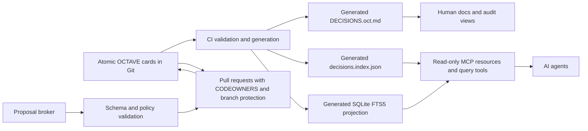
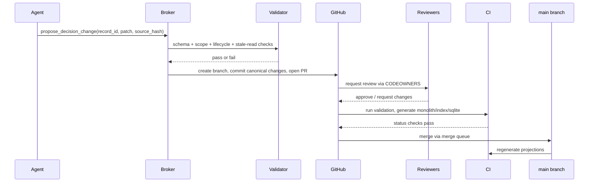
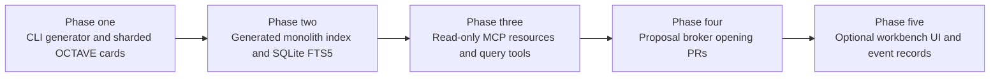

# Decision Registry Concurrency Research for OCTAVE Governance

*Target save path: `.hestai/state/reports/2026-05-19-decision-registry-concurrency-research.md`*

## Executive summary

Existing solutions fall into a few recognisable families: Git-native sharded decision records; append-only event logs; database-backed registries; MCP read/write layers; PR-automation and merge-queue workflows; collaborative CRDT editors; and structured merge tooling. All of them solve part of Elevana’s problem, but none of the mature off-the-shelf products I found cleanly combine all of these in one package: Git-native PR ratification, agent-readable structured querying, semantic lifecycle handling, safe concurrent proposal intake, append-only provenance, and OCTAVE-preserving exports. The market is mature for ADR capture/rendering and repository governance, emerging for MCP-based agent access, and mature for event stores and databases, but not for an integrated “AI-native governance registry”. citeturn28search0turn27search1turn29search0turn19view0turn10view5turn6view0turn6view1turn6view2turn23view2

The closest thing to an industry standard is still Git-native, one-record-per-decision documentation with PR review, combined with generated indexes or portals. ADR tools, MADR, Log4brains, Structurizr, and Backstage all assume that decisions are discrete files in source control and that human review remains the ratification path. That pattern is stable, understandable, and works well with developer workflows. It does **not**, by itself, solve semantic conflict detection or agent-safe writes; it mostly reduces collision surface and improves navigation. citeturn28search0turn27search1turn29search0turn19view2turn19view0turn19view1

For Elevana, the most viable near-term architecture is a **hybrid**: keep Git as the canonical store, review layer, and long-term audit trail; split the monolith into **atomic OCTAVE decision records**; generate a monolithic export plus a structured index and app/domain projections; add a **generated SQLite FTS5/BM25 read model** for deterministic retrieval; and expose that through a **read-only MCP layer first**. If write pressure rises, add a **proposal broker** that validates changes and opens PRs rather than writing directly to canon. Introduce append-only lifecycle events only if amendment/status churn becomes frequent enough to justify the extra complexity. citeturn20view2turn20view1turn20view0turn20view3turn18view0turn18view1turn6view1turn6view2turn23view2turn21search4

What to avoid: keeping a single writable `DECISIONS.oct.md` as the only editing surface; making MCP a direct production write authority too early; using CRDTs as the canonical governance store; or relying on Git’s `union` merge or similar low-level merge tricks to “solve” policy conflicts. Those approaches either preserve the current conflict problem or optimise text concurrency without solving governance semantics. citeturn16view0turn16view1turn17search0turn12search0turn12search2turn23view2

## Problem framing and Git’s role

This is not primarily a Markdown problem, a token-bloat problem, or an ADR-template-selection problem. Those are secondary concerns. The real engineering problem is the separation of five concerns that are currently entangled in one file: canonical authority, agent query access, human-readable review, concurrent proposal intake, and durable audit history. A monolithic document makes one artefact carry all five jobs at once; that is what creates line-level write contention and ambiguity about whether a change is a correction, an amendment, a supersedure, or a lifecycle update. The right comparison is not “which file format is nicest?” but “which architecture gives one clear source of truth while allowing multiple read models and controlled proposal flows?” citeturn16view0turn16view3turn6view1turn6view2turn15search3

Git is still extremely valuable here. It solves distributed history, immutable commit trails, code review, blame, reversibility, protected-branch workflows, CODEOWNERS review routing, and merge-queue serialisation. GitHub branch protection can require approvals and passing checks before merge; CODEOWNERS can request review automatically and even require code-owner approval; merge queue can retest queued pull requests against the latest protected branch so the branch does not break under merge pressure. Those are real governance primitives. citeturn20view2turn20view1turn20view0

But Git does **not** solve decision semantics. Git’s merge machinery is explicitly file-level and, by default, three-way text merge. Custom merge drivers can be attached to a path; Git even offers a built-in `union` merge driver that simply keeps lines from both sides, but Git’s own documentation warns that this can leave content in random order and should not be used casually. `git rerere` can remember how a human previously resolved a conflict and replay the same resolution later, which is useful for repeated textual conflicts, but it still reuses a past **text** resolution, not a governance judgement. None of this tells you whether two ratification events are compatible, whether one supersedes the other, or whether a stale read should invalidate the proposal. citeturn16view0turn16view1turn16view3turn17search0

That is why one-file-per-record is so often the first successful move. ADR tools create numbered records and can explicitly mark a new record as superseding an older one; Backstage’s own ADR guidance says records are never deleted and may instead be superseded or deprecated; Log4brains and Backstage both organise decision content as many source files and then render browsable views from them. This reduces the collision surface dramatically because “new decision” changes and “different decision” changes become separate files. It does **not** eliminate same-record contention, but it turns the common case from “everyone edits the same book” into “most people edit different cards”. citeturn28search0turn19view1turn29search0turn19view0

Git can also play a cleaner role if projections are generated rather than edited. GitHub supports marking generated artefacts as `linguist-generated` in `.gitattributes`, which hides them by default in diffs. That is a useful fit for a generated monolith, JSON index, or SQLite snapshot: reviewers focus on the canonical card/event changes, while generated outputs remain reproducible artefacts rather than competing truth sources. citeturn20view3

## Pattern survey

The table below scores the main patterns against Elevana’s concerns. “High” means the pattern natively helps; “Medium” means it helps with careful supporting design; “Low” means it largely misses the problem.

| Pattern | Canonical authority | Concurrent write safety | Conflict types handled | Git’s role | Strengths for Elevana | Main gap | Representative sources |
|---|---|---:|---|---|---|---|---|
| Single monolithic file | One markdown file | Low | Text only | Canonical, review, audit, merge | Simplest read path; no migration | Worst write surface; line-based collisions; no semantic separation | citeturn16view3turn20view2 |
| Git-native sharded records | Per-decision files in repo | High for cross-record, low for same-record | Text plus some structural checks via schema/CI | Canonical, review, audit | Best near-term fit; preserves PR review; easy generated indexes | Same-record semantics still external to Git | citeturn28search0turn27search1turn29search0turn19view0turn19view1 |
| Atomic records plus append-only events | Files or event store plus projections | High for append paths | Temporal, lifecycle, supersedure, provenance; semantic checks need projection logic | Canonical if file/event stream is source; Git often review/audit/export | Strong auditability; clear history; fewer destructive edits | More moving parts; projections required for “current state” | citeturn7search24turn21search4turn21search1turn7search2 |
| Database-backed registry | DB rows/events | High in Postgres, medium in SQLite | Structural and same-record conflicts; semantic rules need app logic | Review/export only unless PR bridge added | Strong constraints, queries, indexing, OCC/locking | Services, auth, backups, risk of second truth | citeturn10view1turn10view2turn10view3turn11view0turn11view1turn10view5 |
| MCP read layer | Backend source remains elsewhere | N/A for writes | None by itself; improves deterministic reads | Unchanged; usually backend remains canonical | Excellent agent query contract; resource URIs; subscriptions | Not a storage model; needs a real backend | citeturn6view1turn6view2turn15search3turn15search4 |
| MCP write broker | Backend source remains elsewhere | Medium to High depending backend | Can enforce structural and some semantic checks before proposal | Often still review/audit layer if broker opens PRs | Good agent UX without surrendering review | Risky if allowed to bypass PR/human gate | citeturn6view2turn23view2turn23view3 |
| Bot-managed PR queue | Git repo | Medium | Branch-compatibility and policy checks; limited semantics without custom logic | Canonical, review, audit, coordination | Low migration cost; natural with GitHub | Mostly serialises merges, not governance meaning | citeturn20view0turn20view1turn20view2turn20view4turn20view5 |
| CRDT collaborative store | Shared document/object store | High for edit concurrency | Text/block/object convergence | Usually downstream export only | Excellent live editing | Solves collaboration mechanics, not binding governance semantics | citeturn12search0turn12search2turn12search16 |
| Structured merge tools | Git repo | Medium | Text and some structure | Canonical, review, audit | Helpful mitigation on stable structured files | Still not semantic governance reasoning | citeturn16view0turn16view3turn17search0 |
| Agent instruction files | Separate prompt/config files | N/A | None | Usually supplementary | Useful for scoped read guidance in monorepos | Not a decision registry and not a write protocol | citeturn25view0turn25view2turn24search2 |

The important dividing line is between tools that manage **documents** and tools that manage **state transitions**. ADR tools, Log4brains, Structurizr, and Backstage are document-first: they assume decisions are files, then layer browsing, indexing, and rendering over those files. That already aligns well with Elevana’s need to preserve Git and OCTAVE, especially because the public `octave-mcp` repository already coexists with a conventional `docs/adr/` directory of separate ADR files; OCTAVE and ADR directories are not inherently competing approaches. citeturn19view2turn19view0turn30view0

Event sourcing and append-only ledgers shift the mental model from “edit the record” to “append what happened”. Fowler’s original event-sourcing description, Azure’s guidance, AWS’s pattern guide, and EventSourcingDB’s precondition model all converge on the same benefits: full traceability, the ability to reconstruct past states, and optimistic concurrency around appends. They also converge on the cost: more complexity, more projections, and a stronger commitment to model changes as events instead of in-place edits. Azure’s guidance is explicit that event sourcing is a complex pattern and that, for many systems, traditional data management is sufficient. That warning matters: append-only governance events are attractive for supersedure, status and audit findings, but they should be introduced because lifecycle history is genuinely important, not because event sourcing sounds modern. citeturn7search24turn21search4turn21search1turn7search2turn7search5

CRDTs and live collaborative editors are the most tempting false friend in this space. Automerge describes itself as a local-first sync engine that works offline and prevents conflicts; Yjs similarly offers shared data types that automatically merge without merge conflicts. That is powerful for collaborative editing. It is not the same as ratified engineering governance. If two agents concurrently set a decision to different lifecycle states, a CRDT may converge on a document state, but it cannot tell you which agent had authority, whether the later update should be rejected as stale, or whether the change should have been an event rather than a field edit. CRDTs are excellent for notebooks, shared notes and live drafts; they are a weak canonical model for binding governance. citeturn12search0turn12search2turn12search16

## Tool catalogue

The practical ecosystem is fragmented but usable. The strongest products each cover a slice of the final architecture rather than the whole thing.

| Tool or project | Type | What it does | Maturity | Fit for Elevana | Main limitation | Primary source |
|---|---|---|---|---|---|---|
| `adr-tools` | CLI / docs-as-code tool | Creates numbered ADR files, supports superseding earlier ADRs, and manages ADR logs in Git | Mature, stable, but low-churn; latest release shown as 2018 | Strong baseline for sharded records and supersedure conventions | Human-oriented markdown; no agent query API or schema model | citeturn28search0 |
| MADR | Template / format | Structured ADR template family for consistent decision records | Mature; MADR 4.0 released in 2024 | Good if you need human ADR companions or a familiar template | Template only, not a concurrency system | citeturn27search1turn27search0 |
| `adr-log` | CLI | Generates an ADR log / TOC and can inject it into markdown files | Niche but practical | Useful for generated indexes or a human landing page | No schema, no write control, no query layer | citeturn19view3 |
| ADR-Manager | Web app | GitHub-connected web UI for MADRs in `docs/adr` | Niche | Helpful for teams that want a light browser UI over Git-backed ADRs | GitHub-only and MADR-only orientation | citeturn19view4 |
| Log4brains | Docs-as-code site generator | Builds a browsable ADR knowledge base from markdown, supports monorepos and global/package ADRs, and advertises no required numbering schema to reduce merge pain | Practical, moderately active; v1.1.0 released in Dec 2024 | Very good for human navigation, app/domain views, and generated docs | Metadata is inferred; weak as a strict machine contract | citeturn29search0turn29search25turn29search9 |
| Structurizr ADR import | Docs/model integration | Imports ADRs into Structurizr and supports `adrtools`, `madr`, and `log4brains`, or a custom importer | Mature platform feature | Useful if you later want architecture views with linked decisions, including custom OCTAVE importers | Not a write-coordination or concurrency system | citeturn19view2 |
| Backstage Software Catalog + ADR plugin | Developer portal + plugin | Harvests entities from source control, keeps files as source of truth, and can search/show ADRs per entity | Mature platform; community ADR plugin actively released | Strong for app/domain discoverability and human audit portals | Operational overhead; ADR plugin assumes markdown ADRs unless custom extensions are added | citeturn10view5turn10view4turn19view0turn8search11 |
| GitHub branch protection, CODEOWNERS, merge queue | Repository governance features | Enforce reviews, status checks, ownership and queued tested merges | Very mature | Essential review and policy layer for any Git-canonical design | They validate process, not decision semantics | citeturn20view2turn20view1turn20view0 |
| Dependabot / Renovate | PR automation bots | Raise automated PRs and support configuration, scheduling, grouping and monorepos | Very mature | Good exemplars for a governance-bot pattern that proposes but does not self-ratify | Dependency-oriented; Elevana would still need custom decision logic | citeturn20view4turn20view5 |
| Notion data sources | SaaS structured DB/doc hybrid | Queryable structured tables with schema, filtering, timestamps and editor metadata | Mature product | Useful for prototyping a registry UI or structured metadata store | Native collaboration model is editing, not PR ratification; enterprise audit controls are separate | citeturn11view0turn11view1turn29search1turn29search15 |
| Airtable | SaaS collaborative database | Structured records plus Enterprise audit log API | Mature product | Can model decision rows quickly | Audit logs are Enterprise-only and retained for 180 days, which is weak for canonical long-term governance history | citeturn11view3turn8search21 |
| SQLite + FTS5 | Embedded DB / search projection | Full-text search with BM25 ranking, weighted columns, deterministic local read model | Extremely mature | Excellent generated projection for agents and tooling, especially in-repo or local | Only one writer transaction at a time; not ideal as a shared canonical multi-writer authority | citeturn10view1turn18view0turn18view1 |
| PostgreSQL | Database | MVCC, explicit locks, serializable transactions and retry semantics | Extremely mature | Best open-source canonical DB if Elevana eventually needs a service-backed registry | Requires service operations and non-trivial retry/error handling | citeturn10view2turn10view3 |
| MCP specification | Protocol | Standardises resources, tools, prompts, capability negotiation and host/server separation | Emerging but fast-moving standard | Excellent for agent query contracts and brokered actions | Not a storage system; unsafe if used as uncontrolled write path | citeturn6view0turn6view1turn6view2turn15search3turn15search4 |
| MCP filesystem server | Reference server | Shows safe directory-scoped file operations and roots-based access control | Reference-quality | Useful as an implementation pattern for confined local file access | File access is still file access; domain semantics must be added separately | citeturn6view4 |
| EventSourcingDB + MCP server | Event store + MCP extension | Append-only event database with preconditions, schemas and an MCP extension exposing read/write/query tools | Emerging but highly relevant | Strong evidence for append-only governance plus agent access patterns | Even its own docs say the MCP server is not intended for production write paths | citeturn21search2turn21search1turn23view2turn23view3turn23view4 |
| SQL MCP Server | MCP server over SQL | Typed CRUD tools with RBAC, built on Data API builder | Emerging vendor-backed pattern | Useful evidence that MCP-over-database is becoming real | Generic CRUD is not governance semantics | citeturn23view0 |
| MongoDB MCP Server | MCP server over MongoDB | Gives agents database context, schemas and data access | Emerging vendor-backed pattern | Shows the “DB context via MCP” pattern at scale | Again, database access is not a governance model | citeturn23view1 |
| Automerge / Yjs | CRDT libraries | Real-time, offline-capable conflict-free collaborative object/document sync | Mature in collaboration space | Good if you ever want collaborative drafting surfaces | Not suitable as the sole ratified governance authority | citeturn12search0turn12search2turn12search16 |
| `AGENTS.md`, `CLAUDE.md`, Cursor Rules | Agent instruction conventions | Persistent repo- or path-scoped instructions for coding agents | Rapidly standardising | Very useful as generated, localised read guidance per app/domain | Not a registry, not an audit log, not a write protocol | citeturn25view0turn25view2turn24search2 |

Taken together, these tools imply a clear conclusion: the best available systems already support **sharded source files**, **generated views**, **searchable read models**, **PR-gated proposals**, **event-style append logs**, and **agent access via MCP** — but usually as separate layers. That is why the likely Elevana answer is a small composite architecture, not a single product replacement. citeturn29search0turn10view5turn20view0turn23view2turn18view0

## MCP and database question

MCP is most useful when the problem is **agent access discipline**, not storage. The spec gives you three relevant primitives: resources, which are application-controlled contextual data; tools, which are model-invokable actions; and prompts, which are user-controlled guidance. MCP resources support listing, reading and resource templates with URIs, and may optionally support `subscribe` and `listChanged`, which is attractive for stale-read detection or “decision list changed since last fetch” notifications. In other words, MCP is excellent for defining a deterministic **query contract** over an existing registry. citeturn15search3turn6view1turn6view2

MCP becomes overkill when the underlying need is still small-scale repository browsing. If Elevana has 50–100 decisions and most agent access is read-heavy, a generated `decisions.index.json` plus a generated SQLite FTS5 database and perhaps a tiny CLI may already satisfy most query needs. SQLite FTS5 can rank results using built-in BM25 and weight columns differently, which makes it a strong lexical retrieval layer for titles, scopes, bodies and evidence fields. But that is a **read projection**, not a governance engine. BM25 is good for term relevance, not semantic conflict resolution, not authority, and not lifecycle rules. citeturn18view0turn18view1turn18view2

A read-only MCP layer therefore makes a lot of sense early. It can expose resources such as `decision://ADR-0042`, `decision://app/portal`, or `decision://supersedure/ADR-0042`, backed by generated JSON and SQLite projections. It can also expose thin query tools such as `find_decisions`, `trace_supersedure`, or `list_decisions_by_scope`, while leaving write authority elsewhere. That improves determinism for agents without changing where truth lives. citeturn6view1turn6view2turn15search3

Write-enabled MCP should be treated more cautiously. MCP’s own tools specification says tools are model-controlled and recommends that implementations keep a human in the loop with clear tool exposure and confirmation for operations. EventSourcingDB’s MCP documentation goes even further: it explicitly says the MCP server is useful for interactive and exploratory workflows, but it is **not intended for production write paths**, where direct SDK or API usage gives better control of preconditions, error handling and transactional guarantees. That is the strongest primary-source evidence I found for Elevana’s “read-only first” instinct. citeturn6view2turn23view2

On databases, the answer is split. A database solves things Git does not: uniqueness constraints, typed fields, row-level structure, transactions, explicit locks, stale-read checks, and fast filtered queries. PostgreSQL offers explicit locking and serializable isolation, but its documentation is equally clear that serializable or repeatable-read applications must be prepared to retry failed transactions. SQLite, by contrast, is wonderfully lightweight and supports multiple readers, but only one simultaneous write transaction. That makes SQLite excellent as a local or generated projection, or as a deliberately serialised single-writer broker store, but a weaker choice for a distributed canonical write authority unless serialisation is the design intent. citeturn10view2turn10view3turn10view1

My recommendation is therefore narrow and pragmatic. **Do not make a database canonical now.** Generate one first. A SQLite projection with FTS5/BM25 is aligned with the research and with Elevana’s scale: it gives agents deterministic lexical retrieval and structured filters while keeping Git as authority. Revisit a canonical Postgres registry only if you empirically find that same-record conflicts, stale reads, and workflow complexity are overwhelming the Git+broker model. That is a threshold decision, not a starting point. citeturn18view0turn10view1turn10view2turn20view2

## Candidate architectures ranked

The most robust pattern for Elevana is **Git-canonical atomic records with generated projections**, optionally fronted by read-only MCP and later guarded by a proposal broker. This keeps PR ratification intact while giving agents something much better than a monolith to read. The strongest comparative fit comes from combining practices already proven independently in ADR tooling, GitHub governance, Backstage-style source-of-truth files, SQLite projections and MCP read contracts. citeturn28search0turn29search0turn10view5turn20view2turn18view0turn6view1



The ranking below is therefore about **when** each candidate becomes appropriate, not only whether it is technically possible.

| Architecture | Effort | Concurrency improvement | Agent readability | Audit quality | OCTAVE fit | Preserves current governance model | Recommendation |
|---|---|---:|---:|---:|---:|---:|---|
| Keep single `DECISIONS.oct.md` | Very low | Very low | Medium for simple reads | High history, poor write ergonomics | High | High | Acceptable only as a temporary read surface, not as the long-term write surface |
| Atomic decision files + generated monolith | Low to medium | High for most parallel work | High once index/projections exist | High | Very high | Very high | **Best first move** |
| Atomic files + append-only events | Medium | High | High if current-state projection is generated | Very high | High | High | **Strong second move** when lifecycle churn justifies it |
| SQLite/Postgres registry + Git export | Medium to high | Medium to very high, depending on DB and workflow | Very high | Medium to high | Medium | Medium unless PR bridge is built | Defer until Git-backed proposals are proven insufficient |
| MCP read layer over Git files/index | Low to medium | Neutral on writes | Very high | Unchanged | Very high | Very high | **Recommended early complement** |
| MCP write broker over Git | Medium | High if broker validates and opens PRs | High | High | Very high | High | **Recommended later complement** |
| MCP write broker over database | High | Very high | Very high | Medium to high | Medium | Medium | Viable later, but premature now |
| Bot-managed PR queue | Low to medium | Medium | Neutral | High | Very high | Very high | Helpful guardrail, but not sufficient alone |
| Collaborative/CRDT store + Git snapshot | High | High for text editing | Medium | Medium | Medium | Low | Avoid as canonical governance architecture |

The recommended phased target therefore looks like this:

**Immediate target.** Atomic OCTAVE decision records in Git; generated monolith; generated structured index; generated app/domain views; branch protection, CODEOWNERS and CI validation. This is the lowest-risk step that materially improves concurrency. It also matches the existing ADR/tooling ecosystem best. citeturn28search0turn19view0turn20view1turn20view2

**Next useful layer.** Read-only MCP sitting over the generated index and SQLite projection. This makes agents faster and more deterministic without changing the approval model. Resource templates and query tools become the stable contract for agents; Git remains authority. citeturn6view1turn6view2turn18view0

**Then, only if needed.** A proposal broker that accepts agent proposals, validates schema/scope/staleness, and opens PRs. This can borrow heavily from the Dependabot/Renovate pattern: propose automatically, ratify through standard review. Merge queue can serialise busy periods; CODEOWNERS can enforce domain ownership; a broker can refuse or rebase stale proposals. citeturn20view4turn20view5turn20view0turn20view1

**Optional later refinement.** Append-only event records for lifecycle changes such as supersedure, retirement, voiding, implementation notes and audit findings. That is worth doing if Elevana discovers that the meaningful change surface is not “rewrite the card” but “record what happened to the decision”. If that becomes the common case, events are worth the projection burden. If not, they are optional complexity. citeturn7search24turn21search4turn7search5



## Audit lens, experiments, prompt, and bibliography

**Walkthrough audit lens.** For each current decision, the audit should determine: whether the decision is still binding; whether it is implemented, partially implemented, never implemented, retired or stale; whether its scope is global, app-specific, domain-specific or cross-cutting; which app/domain tags it needs for deterministic retrieval; whether it has been superseded, deprecated or voided; whether the supersedure chain is explicit and traversable; whether evidence or implementation references exist; whether future changes should edit the core record or append a lifecycle event; whether the decision would be discoverable through an app-local query; and whether multiple agents are likely to propose changes to the same record concurrently. Those questions are what will tell Elevana whether “atomic cards only” is enough or whether lifecycle events need to become first-class. citeturn19view1turn19view0turn21search4

**Recommended experiments.** Start with the smallest experiments that expose the real failure modes rather than building a platform up front.

- Split 5–10 existing decisions into atomic OCTAVE files and generate a monolithic export plus `decisions.index.json`.
- Add explicit scope tags for app, domain and global/cross-cutting reach, then generate one app-scoped view, such as “what governs the portal?”.
- Build a tiny SQLite projection with FTS5/BM25 over title, summary, scope, status and body; verify deterministic retrieval against known questions. citeturn18view0turn18view1
- Prototype `trace_supersedure(token)` over explicit edges and verify that stubs, replacements and retired decisions render cleanly for both humans and agents. citeturn19view1
- Simulate two concurrent agents: one changing different decisions, then the same decision. Measure how often the broker/CI can safely auto-handle, versus how often human judgement is genuinely required.
- Prototype a read-only MCP server over the generated index/SQLite projection before building **any** write tools. citeturn6view1turn6view2
- If status churn is high in those tests, prototype one append-only event type such as `decision.status_changed` or `decision.superseded` and generate current state from it. citeturn21search4turn21search1

**Acceptance criteria.** Elevana should consider the first phase successful only when these conditions are met.

- There is one authoritative editable source per decision record.
- Generated monoliths, indexes and SQLite projections are clearly marked non-authoritative.
- Two agents updating different decisions produce clean parallel PRs with no manual merge work.
- Same-record proposals can be detected as stale or conflicting before merge.
- Agents can answer app/domain-scoped queries deterministically from the generated index or SQLite projection.
- Supersedure chains are machine-traversable and human-readable.
- Branch protection, CODEOWNERS and CI validation still control ratification.
- Generated artefacts are reproducible and de-emphasised in diffs.
- The architecture can still operate if MCP is unavailable, because canon remains in Git.

**Suggested schema examples.** These are not mandates; they are concrete starting points that preserve OCTAVE while separating canon from projections.

```yaml
# atomic OCTAVE decision card
id: DEC-0042
kind: decision
title: Use proposal broker for governance writes
status: binding
scope:
  level: cross-cutting
  apps: [portal, scripts]
  domains: [governance, agent-orchestration]
lifecycle:
  ratified_at: 2026-05-19
  implemented_state: partial
supersedes: [DEC-0017]
superseded_by: []
owners: [platform-governance]
authority:
  canonical_path: .hestai/decisions/DEC-0042.oct.md
  revision: 7
  source_commit: abcdef1
retrieval:
  aliases: [proposal-broker, governance-broker]
  tags: [mcp, git, pr-review, write-control]
evidence:
  - type: pr
    ref: PR-123
  - type: doc
    ref: docs/adr/adr-0042-proposal-broker.md
body_octave: |
  TITLE::Use proposal broker for governance writes
  STATUS::binding
  ...
```

```json
{
  "event_id": "EVT-2026-05-19T12:30:15Z-0001",
  "decision_id": "DEC-0042",
  "event_type": "decision.status_changed",
  "actor": {
    "type": "agent",
    "id": "governance-broker"
  },
  "source": {
    "read_revision": 7,
    "read_commit": "abcdef1",
    "proposal_id": "PROP-0091"
  },
  "payload": {
    "from_status": "approved",
    "to_status": "binding",
    "reason": "Ratified via PR #123"
  },
  "recorded_at": "2026-05-19T12:30:15Z"
}
```

```sql
CREATE TABLE decisions (
  decision_id TEXT PRIMARY KEY,
  title TEXT NOT NULL,
  status TEXT NOT NULL,
  scope_level TEXT NOT NULL,
  canonical_path TEXT NOT NULL,
  revision INTEGER NOT NULL,
  source_commit TEXT NOT NULL,
  ratified_at TEXT,
  implemented_state TEXT,
  owner_json TEXT NOT NULL,
  tag_json TEXT NOT NULL
);

CREATE TABLE decision_events (
  event_id TEXT PRIMARY KEY,
  decision_id TEXT NOT NULL REFERENCES decisions(decision_id),
  event_type TEXT NOT NULL,
  actor_type TEXT NOT NULL,
  actor_id TEXT NOT NULL,
  read_revision INTEGER,
  read_commit TEXT,
  payload_json TEXT NOT NULL,
  recorded_at TEXT NOT NULL
);

CREATE TABLE decision_edges (
  from_decision_id TEXT NOT NULL,
  edge_type TEXT NOT NULL,          -- supersedes, constrained_by, related_to
  to_decision_id TEXT NOT NULL,
  PRIMARY KEY (from_decision_id, edge_type, to_decision_id)
);

CREATE TABLE files (
  canonical_path TEXT PRIMARY KEY,
  sha256 TEXT NOT NULL,
  generated INTEGER NOT NULL DEFAULT 0
);

CREATE VIRTUAL TABLE decision_fts USING fts5(
  decision_id UNINDEXED,
  title,
  summary,
  scope_text,
  tags_text,
  body_text,
  content='',
  tokenize='unicode61'
);

-- typical ranking query
-- SELECT decision_id FROM decision_fts
-- WHERE decision_fts MATCH ?
-- ORDER BY bm25(decision_fts, 10.0, 4.0, 2.0, 2.0, 1.0);
```

**Phased rollout.** The least risky sequence is incremental rather than ambitious.



**Executive prompt for a solution-engine or LLM architect.**

```text
Design a governance broker/workbench for Elevana’s OCTAVE decision registry.

Context:
- Primary consumers are AI agents.
- Humans still require reviewability, provenance and auditability.
- Existing canonical corpus is Git-backed and PR-reviewed.
- OCTAVE DSL must be preserved, not replaced casually.
- A single monolithic DECISIONS.oct.md has become a poor concurrent write surface.
- We need one canonical source of truth, not multiple competing ones.

Research-backed design target:
- Git should remain the initial canonical store, review layer and long-term audit trail.
- Canonical records should be atomic, one decision per file.
- Generated artefacts should include:
  - monolithic DECISIONS.oct.md export
  - decisions.index.json
  - app/domain-specific views
  - SQLite + FTS5/BM25 read projection
- MCP should be read-only first.
- Writes should be proposal-based and PR-ratified.
- Append-only lifecycle events should be supported or at least designed for.
- A later migration to a canonical database must remain possible if Git-backed proposal handling proves insufficient.

Please produce:
1. A concrete architecture for a governance broker/workbench that:
   - accepts agent proposals
   - validates and normalises OCTAVE cards
   - detects stale reads using source revision or source hash
   - generates ADR drafts for human rationale where appropriate
   - creates PRs rather than directly ratifying changes
   - maintains append-only event records for lifecycle changes
   - exposes MCP read tools and optional MCP proposal tools
   - enforces fail-closed identity/redaction/provenance rules
   - keeps generated outputs explicitly non-authoritative
2. A phased implementation plan:
   - CLI generator
   - generated index and SQLite projection
   - read-only MCP
   - proposal broker
   - optional workbench UI
3. Acceptance criteria and test scenarios, including:
   - two agents changing different decisions
   - two agents changing the same decision
   - supersedure chain traversal
   - app-local decision queries
   - rollback and reconstruction from canon
4. Mermaid diagrams for:
   - architecture overview
   - propose → PR → merge data flow
   - phased rollout timeline
5. Suggested schemas for:
   - atomic OCTAVE card
   - append-only decision event
   - SQLite tables for decisions, decision_events, decision_edges, files and FTS
6. Operational guidance on:
   - branch protection
   - CODEOWNERS
   - generated file handling in diffs
   - when to move from Git-canonical to DB-canonical
7. Explicit non-goals:
   - no direct write-authority MCP in phase one
   - no CRDT canonical store
   - no premature heavy platform build
   - no second editable source of truth
```

**Open questions and limitations.** The research did not uncover a single mature product purpose-built for “agent-readable, auditable decision governance with safe concurrent updates” in the exact form Elevana wants. What remains to test empirically is whether Elevana’s actual churn is mostly “new decisions” or “many updates to the same few decisions”; whether lifecycle events are frequent enough to justify an append-only event model; whether a generated SQLite projection is sufficient for agent retrieval quality; and whether a Git-based proposal broker plus merge queue materially reduces same-record pain before a canonical database is considered. Those are implementation questions, not gaps in the pattern survey. citeturn20view0turn18view0turn10view1turn7search5

**Bibliography.** The most load-bearing primary sources used in this review were the following.

- Model Context Protocol specification and architecture docs, especially resources, tools, control hierarchy and security guidance. citeturn6view0turn6view1turn6view2turn15search3turn15search4
- GitHub documentation for branch protection, CODEOWNERS, merge queue and generated-file diff handling. citeturn20view2turn20view1turn20view0turn20view3
- `adr-tools`, MADR, `adr-log`, Log4brains, Backstage ADR plugin and Structurizr ADR documentation. citeturn28search0turn27search1turn19view3turn29search0turn19view0turn19view2
- Backstage Software Catalog source-of-truth model in source control. citeturn10view5turn10view4
- Event sourcing references from Martin Fowler, Azure, AWS and EventSourcingDB. citeturn7search24turn21search4turn7search2turn21search1turn23view2turn23view3
- SQLite transaction and FTS5/BM25 documentation. citeturn10view1turn18view0turn18view1
- PostgreSQL locking and serialisation failure documentation. citeturn10view2turn10view3
- Notion and Airtable documentation around structured data sources and audit logs. citeturn11view0turn11view1turn29search1turn29search15turn11view3
- MCP-over-database examples from EventSourcingDB, Microsoft SQL MCP Server and MongoDB MCP Server. citeturn23view2turn23view3turn23view0turn23view1
- Automerge and Yjs documentation for CRDT-based collaboration. citeturn12search0turn12search2turn12search16
- OpenAI Codex `AGENTS.md` docs and Claude Code’s `.claude`/`CLAUDE.md` docs for agent instruction conventions. citeturn25view0turn25view2turn25view3